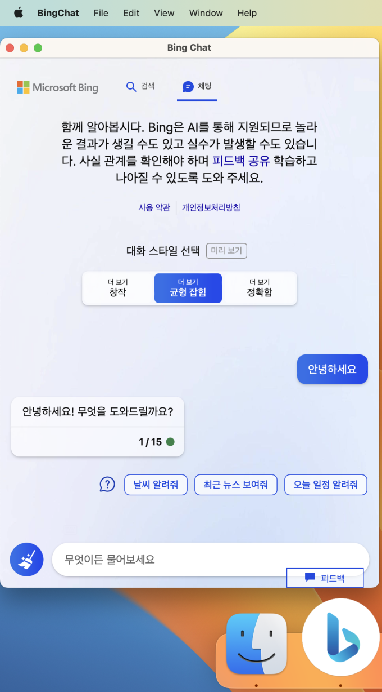

# Bing Chat for macOS
WebKit-based Bing Chat exclusive macOS app

This is a Bing Chat exclusive app that adjusts the User-agent value to access Bing Chat directly without the Edge web browser on macOS. This way, it takes up less memory and avoids problems that occur when typing in Korean in Bing Chat questions in the Edge web browser.

## Warning
Bing is a trademark of Microsoft. The address of the Bing website accessed in this app may be affected without notice due to changes in the service.

## Screenshot

## Support version
- macOS 13.1

## Contributor
- [Ned Park](https://github.com/nedpark)